# RSVP Reader

[English](README.md) · [Español](README.es.md)

RSVP Reader is a local-first web app for preparing long texts and reading them with rapid serial visual presentation workflows, fixed Ebook pages, bookmarks, and local sessions.


## Features

- Source import from paste, files, URL extraction, Wikipedia search, and a public-domain library.
- Reading modes: ORP word, Line flow, Chunk, and Ebook.
- Global reading navigation with page input, progress slider, search, outline, line navigator, sentence/paragraph jumps, and bookmarks.
- Ebook layout with one page, two pages, portrait/landscape single-page mode, fixed page height, chapter context, keyboard page turns, line marker, and optional auto-highlight/page advance.
- Local saved sessions with text, source metadata, settings, theme, language, progress, and bookmarks.
- English and Spanish UI.
- Markdown-aware paste mode for headings and Ebook rendering.
- Local install instructions and Vercel-ready Next.js project structure.

There is no backend, login, account system, or cloud sync in this phase. Data is stored in the user's browser.

## Requirements

- Node.js 20+
- npm 10+

If you do not have Node.js, install the current LTS installer from [nodejs.org](https://nodejs.org/). npm is included with Node.js.

## Run Locally

```bash
git clone https://github.com/daclapo/RSVP-Reader.git
cd RSVP-Reader
npm install
npm run dev
```

Open `http://localhost:3000`.

Production build:

```bash
npm run build
npm run start
```

Quality checks:

```bash
npm run lint
npm run build
```

## Usage

1. Open `Source` and paste text, upload a file, load a URL, or choose a library book.
2. If pasted text is Markdown, set `Text format` to `Markdown` so headings become navigation points.
3. Open `Reader`, choose ORP, Line flow, Chunk, or Ebook.
4. Use the progress slider or page input to move through the text.
5. Add bookmarks for important locations.
6. Save a session from `Sessions` to resume later.
7. Use `Classic` if you prefer the older three-column workspace.
8. Use `Settings` for theme, language, typography, Zen mode, and local data reset.

Keyboard shortcuts:

- `Space` / `K`: play or pause
- `ArrowLeft`: previous word, or previous page in Ebook
- `ArrowRight`: next word, or next page in Ebook
- `[` and `]`: decrease or increase WPM
- `F` in Reader: focus line search
- `Esc`: exit Zen

## About the App

The screenshots below follow the normal workflow: prepare a source, choose a reader mode, then use focused tools such as Zen, Classic layout, themes, sessions, and bookmarks.

### Prepare a Source

Paste text directly and review the exact content that will be sent to the reader.

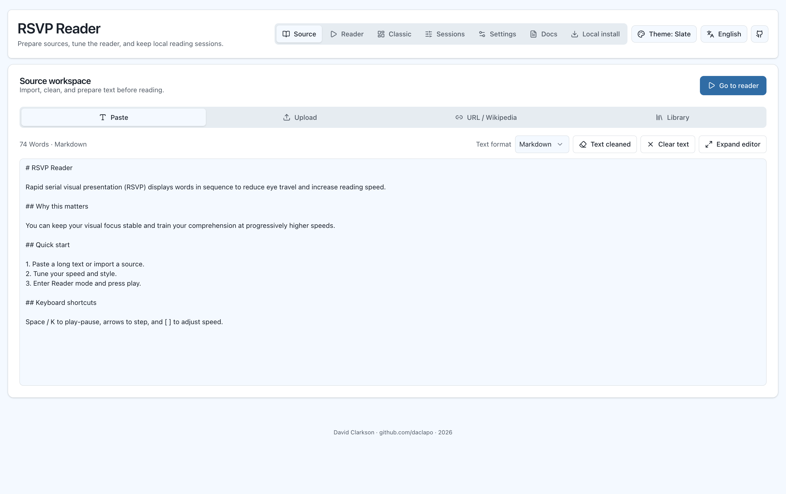

Upload common document formats such as `.pdf`, `.txt`, `.epub`, `.md`, and `.docx`.

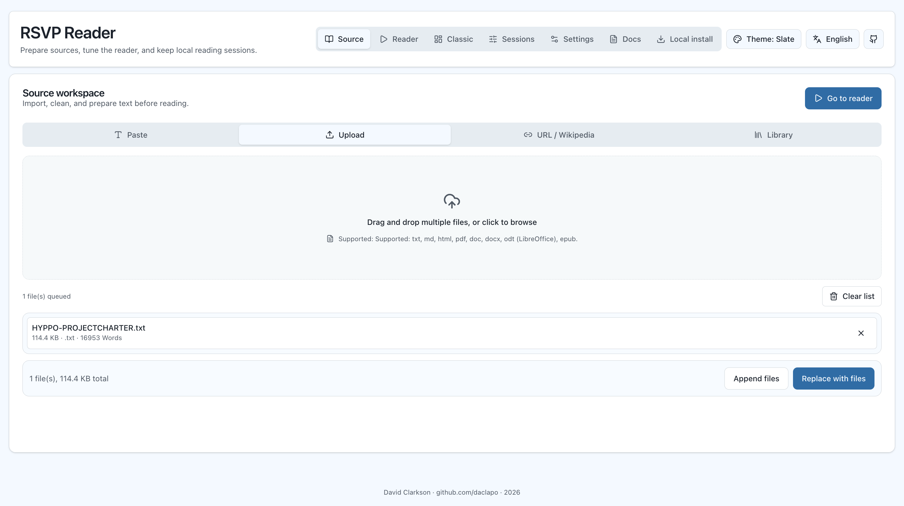

Load a single URL, queue multiple URLs, or search and import a Wikipedia article from the URL / Wikipedia source panel.

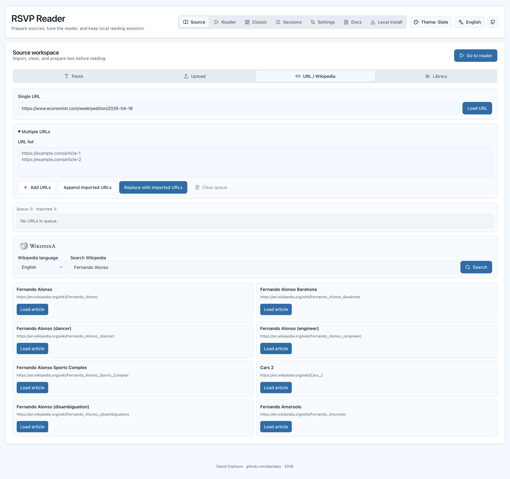

Open a public-domain title from the built-in library.

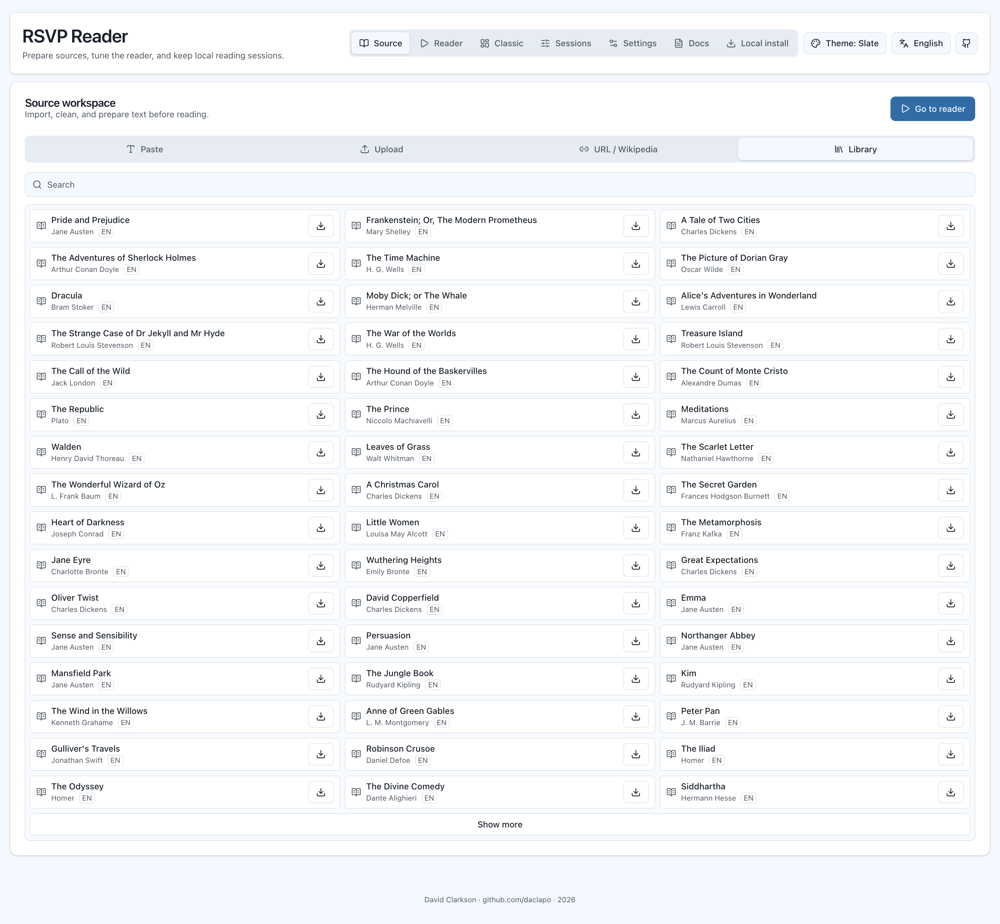

### Read with RSVP Modes

ORP mode centers one word at a time and marks the optimal recognition point.

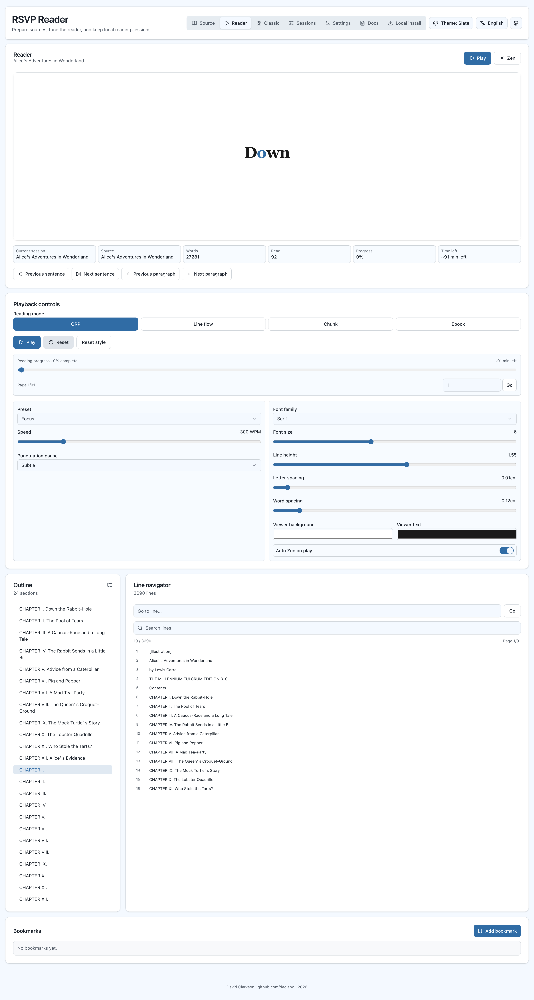

Line Flow keeps the current line centered while preserving context before and after the active position.

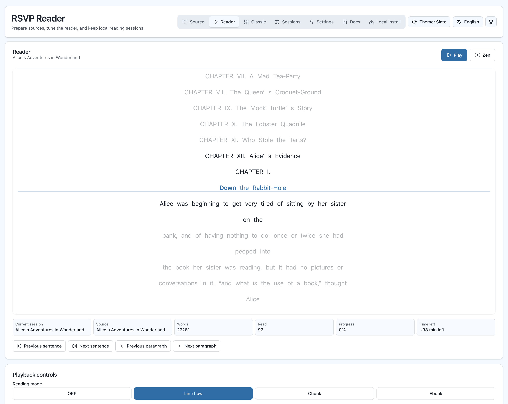

Chunk mode advances through small groups of words instead of single words.

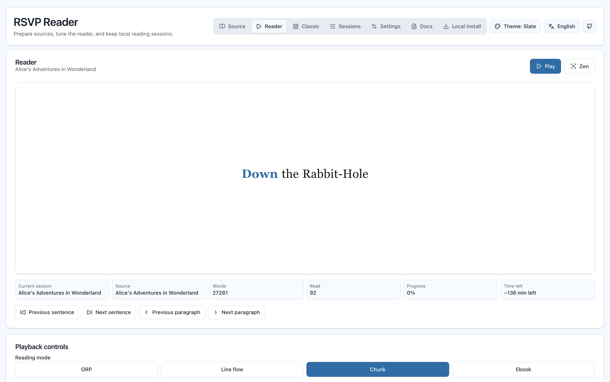

### Read Naturally in Ebook Mode

The two-page Ebook layout is designed for more traditional reading, with page navigation, chapter context, and an optional line marker.

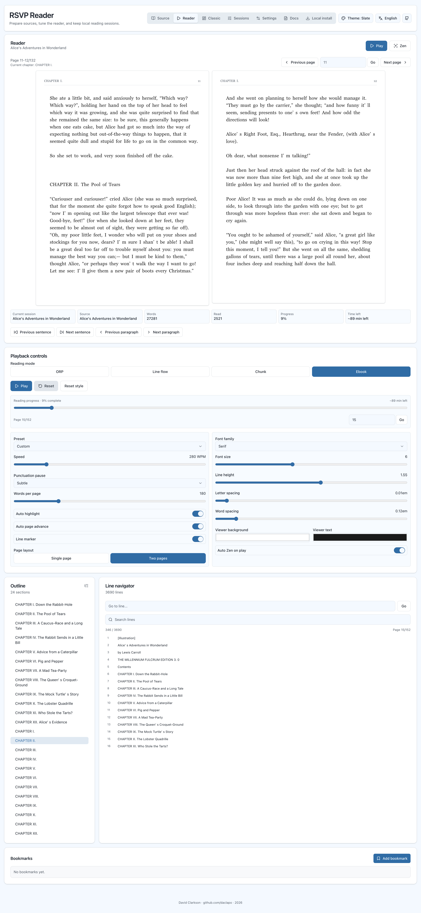

You can also read in a single-page layout.

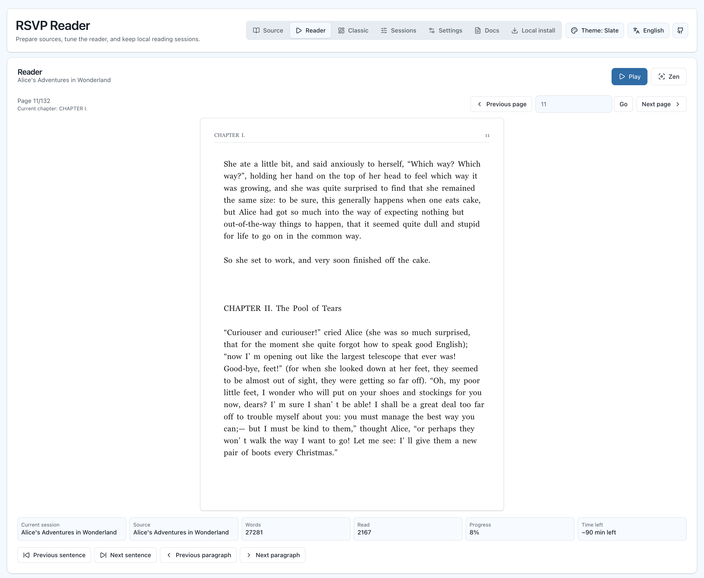

Or a single-page landscape layout, that uses a broader page, where you can fit more text, and do less line jumping for a smoother reading experience. This image also show the 'player' for this mode where the word will be highlighted, and there´ll be a dot that indicates the line you´re currently reading, for easy line jumping.
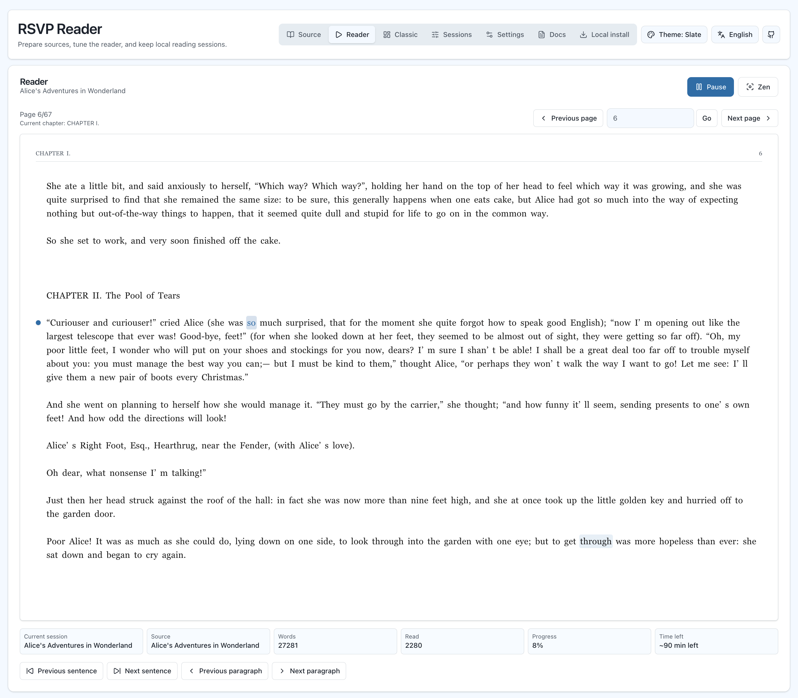

### Other Features

#### Zen mode
Zen mode makes the reader fullscreen and removes surrounding interface. Use `Esc` to exit, and `Space` or `K` to play or pause.

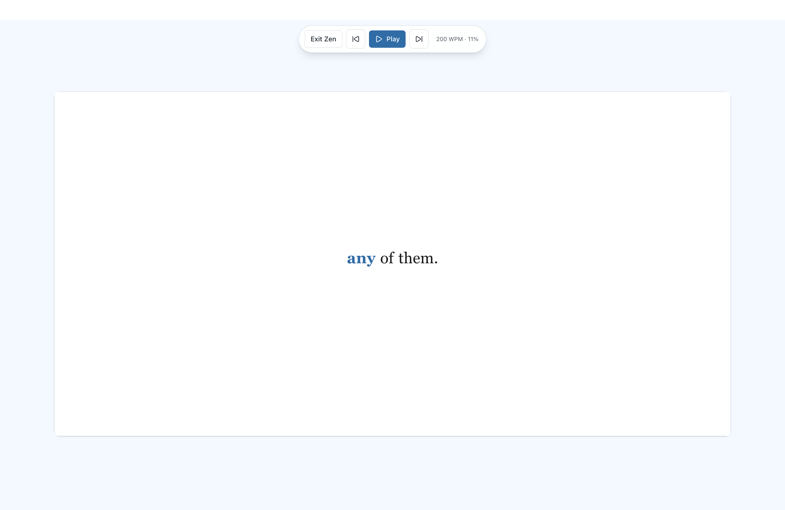

#### Classic viewing mode
Classic view keeps source, reader, and summary tools visible in a single workspace for users who prefer the older arrangement.

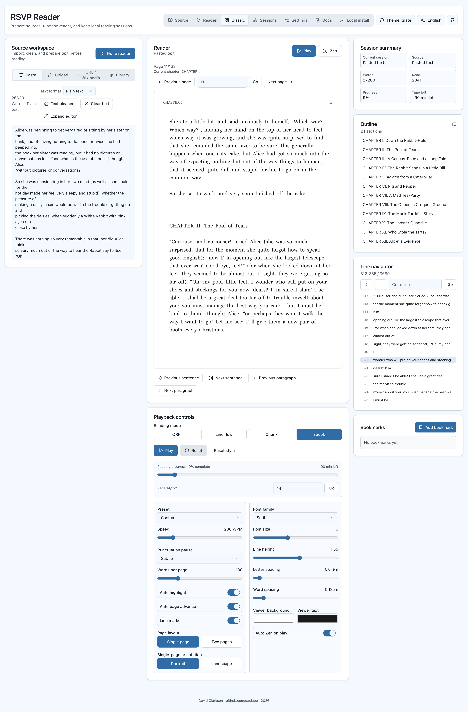

#### Themes
Seven visual themes are available from the Theme menu in the navbar.

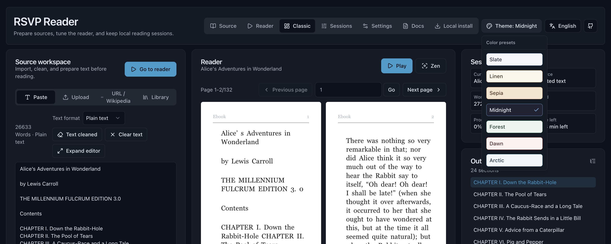

#### Sessions
Sessions let you save multiple reading states locally, including text, source metadata, reading position, bookmarks, theme, language, and reader settings.

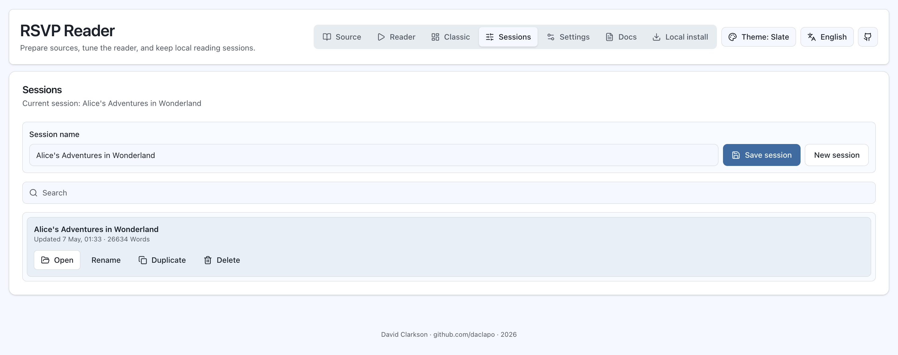


## Sources

Supported uploads are best effort for:

- `.txt`, `.md`, `.markdown`
- `.html`, `.htm`
- `.pdf`
- `.doc`, `.docx`
- `.odt`
- `.epub`

URL imports use `src/app/api/proxy/route.ts`, `@mozilla/readability`, and local cleanup. Some websites block extraction; in those cases, paste text manually.

Wikipedia search uses MediaWiki `opensearch` and page parsing APIs through `src/app/api/wikipedia/route.ts`, then cleans the article into readable Markdown-like text.

The built-in library uses public-domain texts, mostly from Project Gutenberg.

## Local Data

The app stores active text, settings, sessions, and bookmarks in browser storage. Very large texts may exceed browser storage limits, so active text persistence is capped defensively. The app should not crash on storage quota errors.

Use `Settings > Clear local data` to remove active text, sessions, bookmarks, theme, language, and settings from the current browser.


## Project Structure

- `src/app/page.tsx`: main application shell and view composition.
- `src/app/api/proxy/route.ts`: URL import proxy and Readability extraction.
- `src/components/`: feature components and local UI primitives.
- `src/hooks/`: playback, preferences, and sessions.
- `src/lib/i18n/`: local dictionaries.
- `src/lib/library/`: public-domain book catalog.
- `src/lib/reader/`: parsing, cleanup, defaults, presets, fonts, and shared types.
- `src/lib/storage/`: browser storage helpers.
- `docs/`: usage, local install, deployment, and contribution notes.


## Contributing

Contributions are welcome: reading modes, extraction quality, public-domain sources, accessibility, mobile polish, documentation, and tests are all useful areas.
